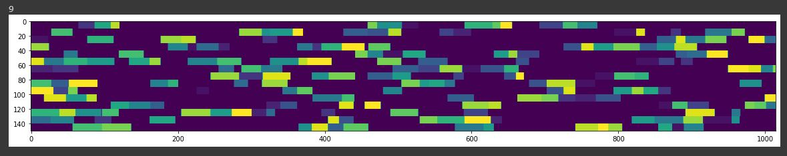
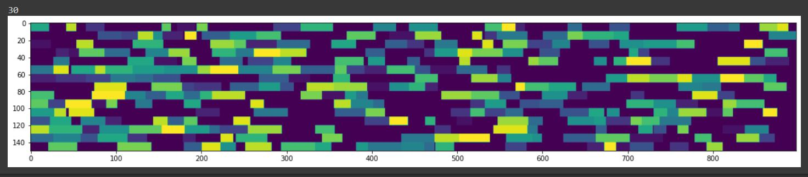
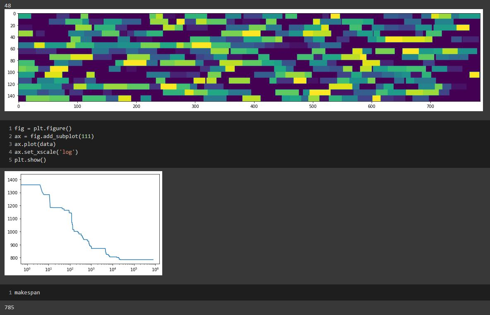
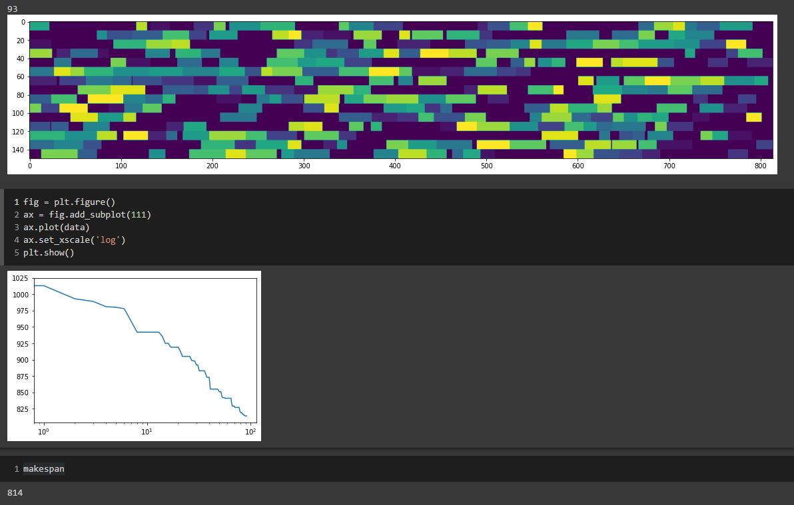
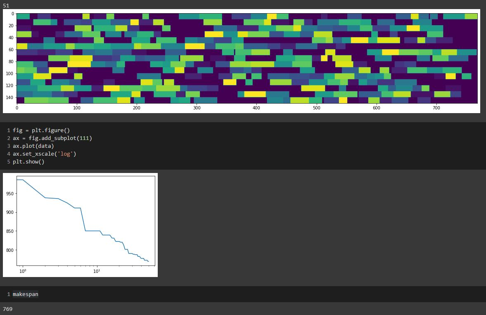

# PC2_AAI_DiegoAtarama
## Ejercicio 1
### Cambios
- Se dividieron los arrays solutions, positions y makespans en dos partes (buenos, nuevos). De esta manera se redujo la cantidad de datos con lo que se trabajaba dentro del bucle While.
- La forma de calcular los $\mu$ mejores estaba incorrecta, se corrigió.
- Se camibó la forma de calcular los índices de los $\lambda$ peores para calcularlos en un solo For y no dos.
### Resultados
- En 3 minutos, el algoritmo sin optimizar lograba 10 iteraciones en total, en mi algoritmo optimizado, logra 30, una mejora del 200%.
- Sin Optimizar: \

- Optimizado: \

- En 9 minutos, el algoritmo EA logra buenos resultados contra Hill Climbing. Sin embargo, el segundo se mantiene con mejor makespan al final de las iteraciones.
- Hill Climbing: \

- Evolutonary Algorithm:

## Ejercicio 2
### Mejoras
- Se implementó la función recombination desde cero, con  el enfoque de utilizar listas para un mejor manejo. 
- De forma aleatoria, se selccionan dos "padres" para combinarse y tener una nueva solución.
- Se logra una mejora considerable del resultado final.
### Resultados
- EA con nswap (93 iteraciones, 814 de resultado final): \

- Hill Climbing (48 nreps, 785 de resultado final): \

- EA con recombination (51 iteraciones, 769 de resultado final): \
 \
Tras 9 minutos, el uso del recombination para el EA es notablemente eficiente. Logramos, con menor cantidad de iteraciones, un mejor resultado.
